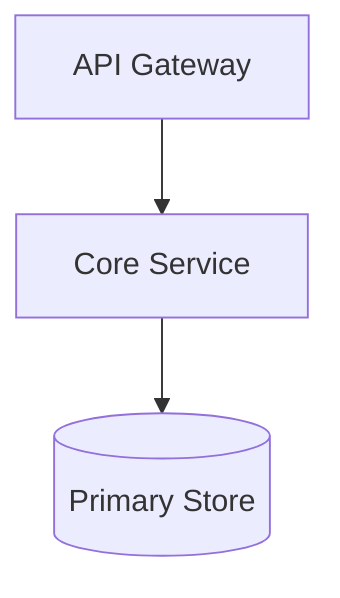
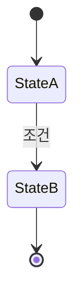

# {시스템명} HLD

## Glossary

| 용어 | 설명 |
|------|------|
| {용어1} | {정의} |
| {용어2} | {정의} |

## Overview

### 시스템 목적
{시스템의 목적과 가치}

### 범위
- 포함: {포함 범위}
- 제외: {제외 범위}

### 대상 독자
{주요 독자}

## System Context

```mermaid
graph TB
    User[사용자] --> System[{시스템명}]
    System --> ExternalA[외부 시스템 A]
```

| 시스템 | 방향 | 프로토콜 | 설명 |
|--------|------|----------|------|
| {시스템A} | Outbound | {REST/gRPC} | {설명} |

## High-Level Architecture



| 컴포넌트 | 역할 | 기술 스택 |
|----------|------|----------|
| {컴포넌트} | {역할} | {기술} |

### 데이터 흐름
1. {단계 1}
2. {단계 2}

## State Transition Model

> 상태가 중요한 도메인에서만 작성합니다. 해당하지 않으면 이 섹션을 삭제합니다.



| 상태 그룹 | 상태 | 설명 | 허용 전이 |
|----------|------|------|----------|
| {그룹A} | {STATE_A} | {설명} | → {STATE_B} |

### 전이 규칙
- {규칙 1}
- {규칙 2}

## Key Design Decisions

| 결정 | 선택 | 대안 | 근거 | 관련 ADR |
|------|------|------|------|----------|
| {결정} | {선택} | {탈락 옵션} | {근거} | {ADR} |

## Non-Functional Requirements

| 항목 | Target | 측정 방법 |
|------|--------|----------|
| P99 Latency | {X}ms | {방법} |
| Throughput | {X} TPS | {방법} |
| Availability | {99.X}% | {방법} |

<!-- Optional: keep this section only when deployment shape matters to the reader -->
## Deployment Overview

| 환경 | 인프라 | 특이사항 |
|------|--------|----------|
| Production | {환경} | {특이사항} |

<!-- Optional: keep this section only for supporting tables, mappings, or detailed references -->
## Appendix

### 참고 표
| 항목 | 값 |
|------|----|
| {항목} | {값} |
