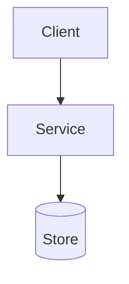
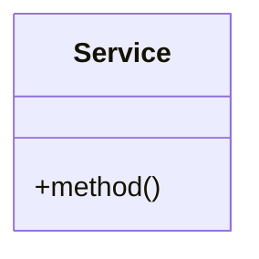

# {시스템명} LLD

<!-- 연관 HLD: HLD가 있을 때만 포함. 소규모 LLD 단독 작성 시 이 섹션 전체를 삭제하세요. -->
## 연관 HLD

| 항목 | 내용 |
|------|------|
| HLD 문서 | `documents/hld/{slug}/DOCUMENT.md` |
| HLD 제목 | {HLD 제목} |
| 상세화 대상 컴포넌트 | {이 LLD가 상세화하는 HLD 컴포넌트 목록} |

### KDD 추적

| HLD KDD | LLD 반영 | 비고 |
|----------|---------|------|
| {KDD-1: 결정 제목} | {설계 판단 근거의 해당 결정} | {일관/구체화/변경 사유} |
| {KDD-2: 결정 제목} | {설계 판단 근거의 해당 결정} | {일관/구체화/변경 사유} |

### NFR 추적

| HLD NFR | HLD 목표 | LLD 구체화 |
|---------|---------|-----------|
| {Latency} | {P99 < 200ms} | {API별 목표: GET < 50ms, POST < 150ms} |
| {Availability} | {99.9%} | {서킷브레이커 임계값, 재시도 정책} |
<!-- /연관 HLD -->

## Glossary

| 용어 | 설명 |
|------|------|
| {용어1} | {정의} |
| {용어2} | {정의} |

## Problem Statement

### 시스템 목표
{핵심 목표}

### 데이터 특성

| 특성 | 수치 | 기술적 의미 |
|------|------|------------|
| Volatility | {값} | {의미} |
| Read/Write Ratio | {값} | {의미} |
| Cardinality | {값} | {의미} |

### 기술적 난제
- {난제 1}
- {난제 2}

### 미해결 리스크

| 리스크 | 영향도 | 발생 확률 | 완화 방안 |
|--------|--------|----------|----------|
| {리스크 1} | 높음/중간/낮음 | {확률} | {완화 방안} |

## Functional Requirements

| ID | 요구사항 | 우선순위 | 검증 기준 |
|----|----------|----------|----------|
| FR-01 | {요구사항} | P0 | {검증 기준} |

## Non-Functional Requirements

| 항목 | Target | 측정 방법 |
|------|--------|----------|
| P99 Latency | {X}ms | {방법} |
| Throughput | {X} TPS | {방법} |
| Availability | {99.X}% | {방법} |
| RTO | {X}분 | {방법} |
| Volume | {X}건/일 | {방법} |

## Goal / Non-Goal

### Goal
- {목표 1}
- {목표 2}

### Non-Goal
- {비목표 1}
- {비목표 2}

## Proposed Design

### 아키텍처 개요



| 컴포넌트 | 역할 | 기술 스택 | 비고 |
|----------|------|----------|------|
| {컴포넌트} | {역할} | {기술} | {비고} |

### API 설계

| Method | Path | 설명 | 인증 |
|--------|------|------|------|
| {POST} | {/api/v1/resource} | {설명} | {JWT} |

#### {POST /api/v1/resource}

**Request**
```json
{
  "field": "value"
}
```

| 필드 | 타입 | 필수 | 검증 | 설명 |
|------|------|------|------|------|
| {field} | {String} | {Y} | {조건} | {설명} |

**Response (200)**
```json
{
  "result": "value"
}
```

**에러 응답**

| HTTP 상태 | 에러 코드 | 조건 | 메시지 |
|-----------|----------|------|--------|
| {400} | {ERR_001} | {조건} | {메시지} |

### 클래스/컴포넌트 설계



| 클래스 | 역할 | 주요 메서드 |
|--------|------|-----------|
| {Service} | {역할} | {method()} |

### DB 스키마

```sql
CREATE TABLE {table_name} (
    id BIGINT PRIMARY KEY AUTO_INCREMENT,
    {column} {type} {constraints}
);
```

| 테이블 | 컬럼 | 타입 | 제약 | 설명 |
|--------|------|------|------|------|
| {table} | {column} | {type} | {NOT NULL} | {설명} |

**인덱스**

| 테이블 | 인덱스명 | 컬럼 | 용도 |
|--------|---------|------|------|
| {table} | {idx_name} | {columns} | {용도} |

### 설계 판단 근거

| 결정 | 채택 옵션 | 탈락 옵션 | 근거 | 감수하는 단점 |
|------|----------|----------|------|-------------|
| {결정} | {채택} | {탈락} | {근거} | {단점} |

### 핵심 전략
- {전략 1}
- {전략 2}

<!-- Optional: keep this section only for supporting calculations, parameter tables, or operational notes -->
## Appendix

### 보조 계산
{계산식 또는 세부 파라미터}
